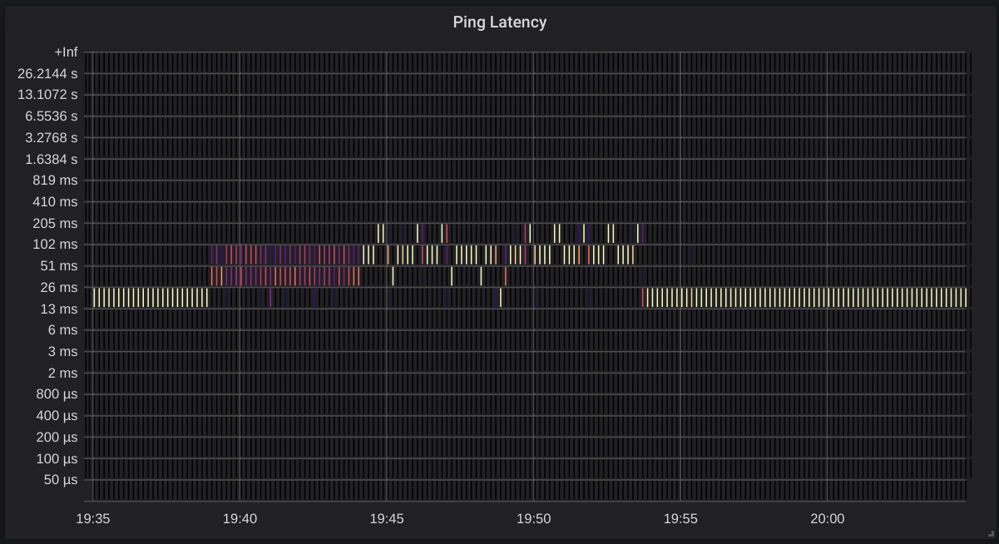

# smokeping_prober

[](https://circleci.com/gh/SuperQ/smokeping_prober/tree/master)
[](https://quay.io/repository/superq/smokeping-prober)

Prometheus style "smokeping" prober.



## Overview

This prober sends a series of ICMP (or UDP) pings to a target and records the responses in Prometheus histogram metrics.

```
usage: smokeping_prober [<flags>] [<hosts>...]

Flags:
  -h, --help                     Show context-sensitive help (also try --help-long and --help-man).
      --config.file=CONFIG.FILE  Optional smokeping_prober configuration yaml file.
      --web.telemetry-path="/metrics"
                                 Path under which to expose metrics.
      --web.systemd-socket       Use systemd socket activation listeners instead of port listeners (Linux only).
      --web.listen-address=:9374 ...
                                 Addresses on which to expose metrics and web interface. Repeatable for multiple
                                 addresses.
      --web.config.file=""       [EXPERIMENTAL] Path to configuration file that can enable TLS or authentication.
      --buckets="5e-05,0.0001,0.0002,0.0004,0.0008,0.0016,0.0032,0.0064,0.0128,0.0256,0.0512,0.1024,0.2048,0.4096,0.8192,1.6384,3.2768,6.5536,13.1072,26.2144"
                                 A comma delimited list of buckets to use
  -i, --ping.interval=1s         Ping interval duration
      --privileged               Run in privileged ICMP mode
  -s, --ping.size=56             Ping packet size in bytes
      --log.level=info           Only log messages with the given severity or above. One of: [debug, info, warn,
                                 error]
      --log.format=logfmt        Output format of log messages. One of: [logfmt, json]
      --version                  Show application version.

Args:
  [<hosts>]  List of hosts to ping
```

## Configuration

The prober can take a list of targets and parameters from the command line or from a yaml config file.

Example config:

```yaml
---
targets:
  - hosts:
      - host: host1
        description: optional host1 description
      - host: host2
      - host: 8.8.8.8
        description: Google DNS
    interval: 1s # Duration, Default 1s.
    network: ip # One of ip, ip4, ip6. Default: ip (automatic IPv4/IPv6)
    protocol: icmp # One of icmp, udp. Default: icmp (Requires privileged operation)
    size: 56 # Packet data size in bytes. Default 56 (Range: 24 - 65535)
```

In each host group the `interval`, `network`, and `protocol` are optional.

The interval Duration is in [Go time.ParseDuration()](https://golang.org/pkg/time/#ParseDuration) syntax.

NOTE: The config is only read on startup, SIGHUP is not supported (yet).

## Building and running

Requires Go >= 1.17

```console
go install github.com/superq/smokeping_prober@latest
sudo setcap cap_net_raw=+ep ${GOPATH}/bin/smokeping_prober
```

## Docker

```bash
docker run \
  -p 9374:9374 \
  --privileged \
  quay.io/superq/smokeping-prober:latest \
  some-ping-target.example.com
```

## Metrics

 Metric Name                            | Type       | Description
----------------------------------------|------------|-------------------------------------------
 smokeping\_requests\_total             | Counter    | Counter of pings sent.
 smokeping\_response\_duration\_seconds | Histogram  | Ping response duration.

### TLS and basic authentication

The Smokeping Prober supports TLS and basic authentication.

To use TLS and/or basic authentication, you need to pass a configuration file
using the `--web.config.file` parameter. The format of the file is described
[in the exporter-toolkit repository](https://github.com/prometheus/exporter-toolkit/blob/master/docs/web-configuration.md).
